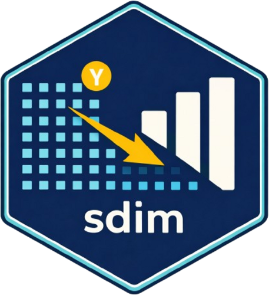

# sdim <a href="https://github.com/GabboCg/sdim"></a>

<!-- badges: start -->
[](https://github.com/GabboCg/sdim/actions/workflows/R-CMD-check.yaml)
[](https://lifecycle.r-lib.org/articles/stages.html#experimental)
[](https://opensource.org/licenses/MIT)
<!-- badges: end -->

## Overview

**sdim** implements four factor extraction methods for asset pricing and macroeconomic forecasting, based on He et al. (2023, MS) and Huang et al. (2022, MS):

| Function | Method | Reference |
|---|---|---|
| `pca_est()` | Principal Component Analysis (PCA) | He et al. (2023, MS) |
| `pls_est()` | Partial Least Squares (PLS) | He et al. (2023, MS) |
| `rra_est()` | Reduced-Rank Approach (RRA) | He et al. (2023, MS) |
| `spca_est()` | Scaled PCA (sPCA) | Huang et al. (2022, MS) |

PCA, PLS, and RRA take a multivariate target (T×N returns matrix) and a matrix of factor proxies. sPCA takes a univariate target and scales each proxy by its OLS slope on the target before extracting principal components. Performance of extracted factors can be evaluated with `eval_factors()`.

The package ships with seven `he2023_*` datasets (factor proxies and portfolio returns) from the He et al. (2023, MS) replication package.

## Installation

```r
# Install from GitHub (not yet on CRAN)
# install.packages("pak")
pak::pak("GabboCg/sdim")
```

## Usage

### Quick start

```r
library(sdim)

set.seed(42)
X   <- matrix(rnorm(200 * 20), 200, 20)   # T x L factor proxies
ret <- matrix(rnorm(200 * 30) / 100, 200, 30)  # T x N returns (target)

# Fit each method
fit_pca <- pca_est(target = ret, X = X, nfac = 3)
fit_pls <- pls_est(target = ret, X = X, nfac = 3)
fit_rra <- rra_est(target = ret, X = X, nfac = 3)

print(fit_rra)
#> <sdim_fit [rra]>
#>  Observations : 200
#>  Predictors   : 20
#>  Factors      : 3

# Evaluate factor quality (RMSPE and total adj-R² from He et al. 2023, §2.4)
eval_factors(ret = ret, factors = fit_rra$factors)
#> Factor Evaluation
#> ----------------------------------------
#>  Portfolios       30
#>  Factors           3
#>
#> Performance (He et al., 2023, §2.4)
#> ----------------------------------------
#>  RMSPE              0.9875  (%)
#>  Total adj-R²       2.9593  (%)
#>  SR                 0.0522
#>  A2R                0.9443
```

### sPCA (univariate target)

```r
y <- rnorm(200)   # univariate return series

fit_spca <- spca_est(target = y, X = X, nfac = 3)
summary(fit_spca)
#> Scaled PCA (sPCA)
#> ----------------------------------------
#> Call: spca_est(target = y, X = X, nfac = 3)
#>
#> Dimensions
#> ----------------------------------------
#>  Observations     200
#>  Predictors        20
#>  Factors            3
#>
#> Eigenvalues
#> ----------------------------------------
#>                      F1       F2       F3
#> Eigenvalue      12.3456   8.7654   5.4321
#> Var. expl. (%)   46.73    33.20    20.57
#>
#> OLS slope summary (beta)
#> ----------------------------------------
#>       0%      25%      50%      75%     100%
#> -0.1234  -0.0512   0.0103   0.0634   0.1521
```

### Replicating He et al. (2023) — Table 3

```r
library(sdim)

# Align dates: he2023_factors ends 12 months earlier than portfolio datasets
he2023_ff48 <- he2023_ff48vw[1:516, -1] / 100 - he2023_ff5$RF[127:642] / 100 # excess returns
G <- he2023_factors[1:516, -1] / 100 # factor proxies

f5 <- G[,1:6] # first 6 columns are Fama-French 5 + momentum

# Number of factods and methods' names
nfact <- c(1, 3, 5, 6, 10)
methods <- c("FF", "PCA", "PLS", "RRA")

# Empty matrix
total_r2 <- matrix(NA, nrow = length(methods), ncol = length(nfact))

# Dimension names
rownames(total_r2) <- methods
colnames(total_r2) <- paste(nfact, "factors")

for (j in seq_along(nfact)) {
  
  # Get number of factors
  k <- nfact[j]
  
  if (k <= 6) {
    
    # Factors
    total_r2["FF", j] <- eval_factors(he2023_ff48, f5[, 1:k])["TotalR2"]
    
  }
  
  # Fit PCA method
  fit_pca <- pca_est(target = he2023_ff48, X = G, nfac = k)
  total_r2["PCA", j] <- eval_factors(he2023_ff48, fit_pca$factors)["TotalR2"]
  
  # Fit PLS method
  fit_pls <- pls_est(target = he2023_ff48, X = G, nfac = k)
  total_r2["PLS", j] <- eval_factors(he2023_ff48, fit_pls$factors)["TotalR2"]
  
  # Fit RRA method
  fit_rra <- rra_est(target = he2023_ff48, X = G, nfac = k)
  total_r2["RRA", j] <- eval_factors(he2023_ff48, fit_rra$factors)["TotalR2"]
  
}

# Output
round(total_r2, 2)
#>     1 factors 3 factors 5 factors 6 factors 10 factors
#> FF      51.39     55.57     57.77     58.34         NA
#> PCA     16.74     20.49     29.91     33.13      40.78
#> PLS     23.42     47.19     58.97     61.10      64.28
#> RRA     54.60     61.11     64.75     65.38      67.40
```

## Getting help

If you encounter a bug, please file an issue with a minimal reproducible example on [GitHub](https://github.com/GabboCg/sdim/issues). For questions, email gabriel.cabreraguzman@postgrad.manchester.ac.uk.

## References

- He, J., Huang, J., Li, F., and Zhou, G. (2023). "Shrinking Factor Dimension: A Reduced-Rank Approach." *Management Science*, 69(9). [doi:10.1287/mnsc.2022.4563](https://doi.org/10.1287/mnsc.2022.4563)

- Huang, J., Jiang, J., Li, F., Tong, G., and Zhou, G. (2022). "Scaled PCA: A New Approach to Dimension Reduction." *Management Science*, 68(3). [doi:10.1287/mnsc.2021.4020](https://doi.org/10.1287/mnsc.2021.4020)
